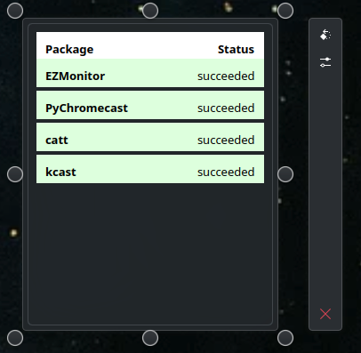
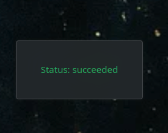

<div align="center">
  <h1>OSBMonitor</h1>
  <a href="https://kde.org/de/">
  
</a>
 <a href="https://www.gnu.org/licenses/gpl-3.0.html">
  
</a>
  <a href="https://paypal.me/agundur">
  
</a>
  </a>
  <a href="https://store.kde.org/p/2290729">
  
  
  <script src="https://liberapay.com/Agundur/widgets/button.js"></script>
<noscript><a href="https://liberapay.com/Agundur/donate"></a></noscript>
</a></div>

## Description
OSBMonitor is a lightweight KDE Plasma 6 applet that displays build status from your Open Suse Build service projects


## ✅ Features

- Built with pure QML – no C++ or Python dependencies


## Visuals




## Installation

```bash
mkdir build && cd build

cmake ..

make

make install (as root)
```

### 🖱 KDE GUI

1. Download `de.agundur.osbmonitor.plasmoid`
2. install with:

```bash
plasmapkg2  --type Plasma/Applet -i de.agundur.osbmonitor.plasmoid
```

## 🛠️ Installing OSBMonitor via the openSUSE Build Service Repository  (recommended)


```bash
# Add the repository
sudo zypper ar -f https://download.opensuse.org/repositories/home:/Agundur/openSUSE_Tumbleweed/home:Agundur.repo

# Automatically import GPG key (required once)
sudo zypper --gpg-auto-import-keys ref

# Refresh repository metadata
sudo zypper ref

# Install OSBMonitor
sudo zypper in osbmonitor
```


## Support
Open an issue in git ...


## Contributing
accepting contributions ...


## Authors and acknowledgment
Alec

## License
GPL


## Project status
active
