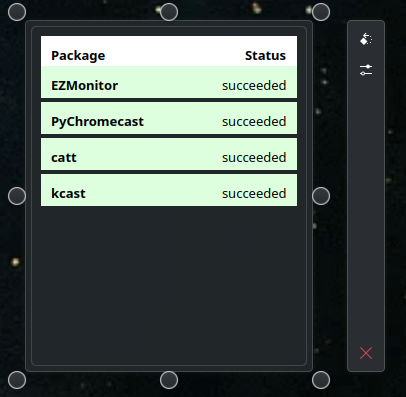
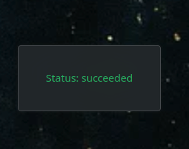

<div align="center">
  <h1>OSBMonitor</h1>
  <a href="https://kde.org/de/">
    
  </a>
  <a href="https://www.gnu.org/licenses/gpl-3.0.html">
    
  </a>
  <a href="https://build.opensuse.org/package/show/home:Agundur/OSBMonitor">
    
  </a>
  <a href="https://paypal.me/agundur">
    
  </a>
</div>

## Description

OSBMonitor is a lightweight KDE Plasma 6 widget that watches your
[openSUSE Build Service](https://build.opensuse.org/) project and shows
build health at a glance, directly in the Plasma panel.

## Features

- **Dual view**: compact panel indicator, full popup with per-package status
- Monitors one configurable OBS project (`home:YourUser` etc.)
- **Configurable refresh interval** — default 5 minutes, adjustable from
  60 seconds up to an hour (Settings)

## Visuals




## Install

Easiest: **"Get New Widgets"** in System Settings, or grab the `.plasmoid`
from the [latest release](https://github.com/Agundur-KDE/OSBMonitor/releases/latest)
and:
```bash
kpackagetool6 --type Plasma/Applet --install osbmonitor-*.plasmoid
```

Also available as a proper package, if you'd rather have `zypper`/`apt`
manage updates:
```bash
# openSUSE Tumbleweed
sudo zypper ar -f https://download.opensuse.org/repositories/home:/Agundur/openSUSE_Tumbleweed/home:Agundur.repo
sudo zypper --gpg-auto-import-keys ref
sudo zypper in osbmonitor

# Debian/Ubuntu — grab the .deb from the latest release above
```

Or straight from source, no build step needed:
```bash
git clone https://github.com/Agundur-KDE/OSBMonitor.git
kpackagetool6 --type Plasma/Applet --install OSBMonitor/package/
```

## Support

Open an issue: [OSBMonitor Issues](https://github.com/Agundur-KDE/OSBMonitor/issues)

## Contributing

Fork and adapt freely.

## License

GPL-3.0-or-later
